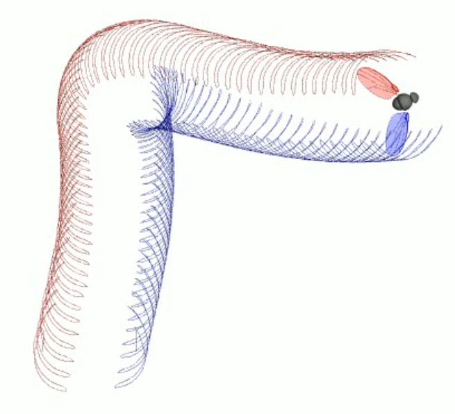

# free-flight-plots 

Example python library for rendering movies from Michael Dickinson and Florian
Muijres's free flight kinematic data. 



## For installation using uv
```bash
uv sync  # from within the project directory
```

## For installation with pip
```bash
pip install .
```

# Usage
For a usage example see the create\_video.py in the examples subdirectory.
```bash
uv run create_video.py data/20121009_S0003.txt
```


